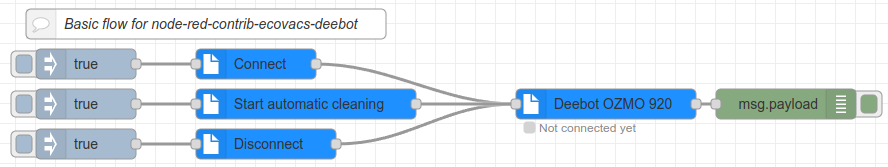

# Ecovacs Deebot node for Node-RED
[](https://www.npmjs.com/package/node-red-contrib-ecovacs-deebot)
[](https://www.npmjs.com/package/node-red-contrib-ecovacs-deebot)
[](https://www.npmjs.com/package/node-red-contrib-ecovacs-deebot)
[](https://github.com/mrbungle64/node-red-contrib-ecovacs-deebot)

Node-RED node for running Ecovacs Deebot vacuum cleaner robots.

There's also initial support for some yeedi models (experimental).

This node uses the [ecovacs-deebot.js](https://github.com/mrbungle64/ecovacs-deebot.js) library.

## Features

Some noteworthy features are:

* Basic cleaning functions (e.g. auto clean, spot area, custom area etc.)
* and various other commands (e.g. play sound, reset consumables, relocate position etc.)
* Retrieve basic information (e.g. battery level, cleaning log, consumable, cleaning and charging status etc.)
* and various extended information (e.g. charging position, current map, network information)
* Retrieve information during the cleaning process (e.g. current position and current spot area)
* Set basic and advanced settings (e.g. continuous cleaning, do-not-disturb mode, TrueDetect 3D, volume etc.)
* Adjustment of vacuum power and water level
* Function for loading the current map image

## Usage

### Ecovacs account

First you have to configure the Ecovacs (or yeedi) account:
- "Name" (optional)
- "Login" (Ecovacs or yeedi)
- "Email / Ecovacs ID" (email or account ID)
- "Password"
- "Country code" (see [here](https://github.com/mrbungle64/node-red-contrib-ecovacs-deebot/wiki/Country-codes) for a list of country codes)

### Available nodes

#### Ecovacs Deebot

Available options: 
- "Account"
- "Name" of the Device
- "Device number"
- "Connect on startup"
- "Retrieve map data object at startup" (experimental)
- "Enable output of simple events" (experimental)

#### Deebot command

Available options:
- "Command" (e.g. `Start automatic cleaning`, `Retrieve battery state`)
- Command specific fields (e.g. `Map ID`, `Spot area ID`)

### Examples

There are 2 example flows provided by this node:

* Basic Flow
* Only laser unit models - save map image to file

You can directly import them from the editor using the [Import dialog](https://nodered.org/docs/user-guide/editor/workspace/import-export).



## Models

### Supported models

* Deebot OZMO 920/950
* Deebot OZMO T8 AIVI
* Deebot X1 Turbo

### Other models

The following models should work properly or at least partially.
They are either already known to work or are technically similar to these models.
Nevertheless, the functionality may be partially limited.

I try to achieve a wide range of functionality, but decide this case by case depending on complexity and various other criteria.
There is of course no claim to full functionality.

#### Ecovacs Deebot

* Deebot N8 series
* Deebot T8 series
* Deebot T9 series
* Deebot T10 series
* Deebot T20 series
* Deebot X1 series
* Deebot X2 series

#### Airbot

* Airbot Z1

#### yeedi

* yeedi k650
* yeedi 2 hybrid
* yeedi vac hybrid
* yeedi vac max
* yeedi vac 2 pro
* yeedi mop station

**Note**: The lists may not be fully complete

### Legacy models (soon to be discontinued)

Legacy models that use XML for data transport (e.g. Deebot OZMO 930, Deebot 900/901) are mostly still working,
but support for these models will be discontinued sooner or later.

Please check [this readme](https://github.com/mrbungle64/ecovacs-deebot.js#legacy-models-soon-to-be-discontinued) for more information.

## Installation

It is recommended to use version 16.x or 18.x of Node.js.

The minimum required version is 14.x, but support for this version may will be dropped soon.

This node uses the [node-canvas](https://www.npmjs.com/package/canvas) library for some map-related functionality which may require the installation of some additional packages.

The installation of canvas is optional and not necessary for models without map functionality, but for full functional range please install the following packages.

For Debian-based Linux systems the following commands should be executed:

```bash
sudo apt-get update
sudo apt-get install build-essential libcairo2-dev libpango1.0-dev libjpeg-dev libgif-dev librsvg2-dev
```

Installation for canvas on alpine based systems (e.g. Node-RED docker container):
```bash
apk add --no-cache build-base g++ cairo-dev jpeg-dev pango-dev giflib-dev
```

A reboot might be necessary before executing the next command
```bash
npm install canvas --unsafe-perm=true
```

For instructions for other systems visit https://www.npmjs.com/package/canvas#compiling

## Known issues

* There's a strange behavior of the battery value on Deebot 900/901. It's very likely that this is a firmware bug
* "Edge" command does not work with Deebot U2 (starts auto clean instead)
* The cleaning log has an empty result on T9 series
* The combined map data object does not work with T9 series
* The generation of map images is currently not stable on 32-bit systems

## Changelog

### 0.4.11
* Bumped ecovacs-deebot.js to latest alpha version

### 0.4.10
* Bumped ecovacs-deebot.js to latest alpha version
* A few changes for AIRBOT Z1 and Z1 Air Quality Monitor

### 0.4.9
* Using library version 0.9.6 (alpha)

### 0.4.8
* Using library version 0.9.5

### 0.4.7
* Using library version 0.9.4
* Add some commands for the cleaning station (X1 Omni/Turbo and similar models)

### 0.4.6
* Using library version 0.9.2 (beta)
* Fixed cleaning log for N8 series

### 0.4.5
* Added some commands for AIRBOT Z1

### 0.4.4
* Using library version 0.9.1 (alpha)
* Fixed cleaning log for T9 based models

### 0.4.3
* Using library version 0.9.0 (beta)
* Some minor improvements and fixes

### 0.4.2
* Using library version 0.8.3 (alpha)
* Added initial support for yeedi login (experimental)

### 0.4.1
* Using library version 0.8.2
* Some minor corrections

### 0.4.0
* Using library version 0.8.1
* Added symbols to the command select box
* Added some events (e.g. DusterRemind, WaterBoxMoppingType, WaterBoxScrubbingType, CleanCount)
* Some further improvements and fixes

### 0.3.17
* Using the latest library version (beta)
* Added commands for Auto-Boost Suction and Clean Preference
* Corrected some labels for commands in the German version
* Some further improvements and fixes

### 0.3.16
* Using library version 0.8.1 (beta)
* Some improvements and fixes

### 0.3.14 - 0.3.15
* Using library version 0.8.0 (beta)

### 0.3.13
* Updated dependencies

### 0.3.9 - 0.3.12
* Using library version 0.7.2 (alpha)
* Stability improvements
* Some minor changes and corrections

### 0.3.8
* Bumped some dependencies (incl. fix for CVE-2022-0155)

### 0.3.7
* Fix the cleaning functions for the Deebot 710 series

### 0.3.6
* Using library version 0.7.0
* Some smaller improvements

### 0.3.5
* Using library version 0.6.8

### 0.3.4
* Using library version 0.6.7

### 0.3.3
* Using library version 0.6.6

### 0.3.2
* Using library version 0.6.3
* Bump minimum required version of Node.js to 12.x

### 0.3.1
* Using library version 0.6.1-beta.7
* Add option for GetMaps command whether to include map image
* Some fixes and improvements

### 0.3.0
* Using library version 0.6.1-beta.3
* Add option to enable retrieving map object on startup
* Add GetSchedule command

### 0.2.9
* Using library version 0.6.1-beta.2
* Add AdvanceMode command (950 type models)
* Add TrueDetect command (experimental)

### 0.2.8
* Using library version 0.6.1-alpha.15
* (unclej84) Add example for saving map image to jpg file

### 0.2.7
* (unclej84) Improve loading of commands.js for deebot-command node 
* (unclej84) Add basic example

### 0.2.6
* (unclej84) Make node compatible with pre-1.3-versions

### 0.2.5
* Using library version 0.6.1-alpha.11
* Some minor changes and fixes

### 0.2.4
* Using library version 0.6.1-alpha.9
* Add EnableDoNotDisturb and DisableDoNotDisturb commands (950 type models)

### 0.2.3
* (unclej84) Help texts for display in editor sidebar

### 0.2.2
* Some minor fixes and improvements

### 0.2.1
* Device number starts with 1

### 0.2.0
* Initial npm release
  * Add a lot of commands and events
  * Using library version 0.6.1-alpha.6
  * (unclej84) Add Multi-language support
  * (unclej84) A lot of improvements for the node editor
  * (unclej84) Use credentials for account data

## Disclaimer

I am in no way affiliated with Ecovacs Robotics Co., Ltd. or yeedi Technology Limited.

## License

GNU GENERAL PUBLIC LICENSE

Copyright (c) 2023 Sascha Hölzel <mrb1232@posteo.de>
