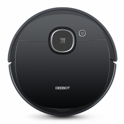

# Ecovacs Deebot node for Node-RED

This node uses the [ecovacs-deebot.js](https://github.com/mrbungle64/ecovacs-deebot.js) library.

> **⚠️ Maintenance Status: Community-Driven Project**
> This project is following a **Community-Driven** maintenance model. Development focuses on the core engine and devices owned by the maintainer. Support for other models depends entirely on community contributions via Pull Requests.

---

## 🗺️ Roadmap & Strategy

To ensure long-term maintainability, we are streamlining the adapter's architecture. **Note: We are currently in the 0.4.x release cycle**

1. **Phase 1 (Planned): Final Legacy Support (Node v0.5.x / Library v0.9.6)**
   * This will be the final version to support legacy hardware using **XML-based protocols** (XMPP/XML and MQTT/XML).
   * No new features will be added for legacy models.
2. **Phase 2 (Planned): Transition to v1.0.0 (Library v1.0.0)**
   * This major update will be **MQTT/JSON-only**.
   * All legacy XML code and dependencies will be removed to improve performance and maintainability.
   * **Breaking Change:** Legacy models will no longer be supported in this version.

---

## Models & Support Tiers

Support is divided into tiers based on hardware availability for the maintainer:

| **Tier** | **Model Series (Examples)** | **Status** |
| :--- | :--- | :--- |
| 🟢 Active | OZMO 920/950, T8 AIVI, X1 Turbo | **Fully Supported.** Owned by maintainer |
| 🟡 Community | T10, T20, T30, X2, X8 etc. | **Best Effort.** Supported via community PRs |
| 🔴 Legacy | OZMO 930, Deebot 900/901 etc. | **Maintenance Only.** Supported in **v0.5.x only** |

### How to get your model supported?
If you want to see a modern (MQTT/JSON) model supported, please contribute the necessary model definitions via **Pull Request** to the [ecovacs-deebot.js](https://github.com/mrbungle64/ecovacs-deebot.js) library. **Requests without an accompanying PR will be closed without further notice**.

---

## Features (Overview)
* Basic cleaning functions (auto, spot area, custom area).
* Retrieve battery level, cleaning logs, and consumable status.
* Set advanced settings like TrueDetect 3D, volume, and do-not-disturb mode.
* Map image loading functionality (requires `canvas`).

---

## Installation & Prerequisites

* **Node.js:** >= 20.x (recommended for compatibility with library v0.9.6+).
* **Node-RED:** Stable version.
* **Optional:** `canvas` for map rendering (see [Wiki](https://github.com/mrbungle64/node-red-contrib-ecovacs-deebot/wiki) for details).

## Disclaimer
I am in no way affiliated with Ecovacs Robotics Co., Ltd. or yeedi Technology Limited. This is a private hobby project.

## License
GNU GENERAL PUBLIC LICENSE - Copyright (c) 2026 Sascha Hölzel